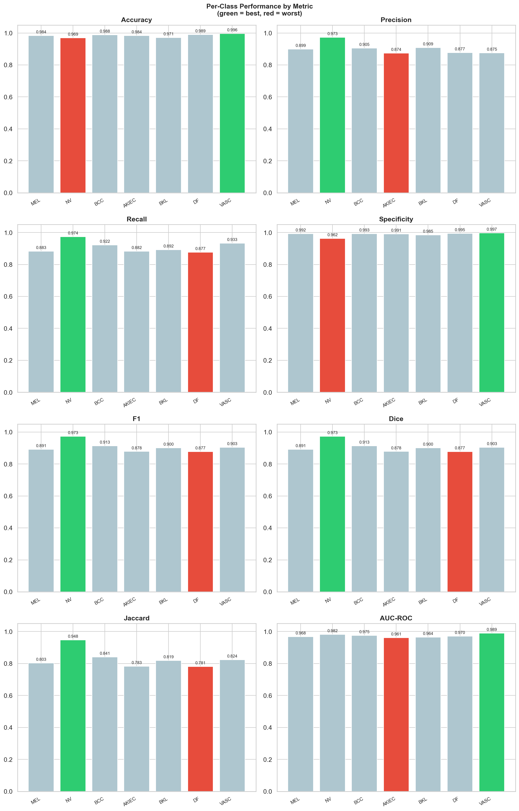
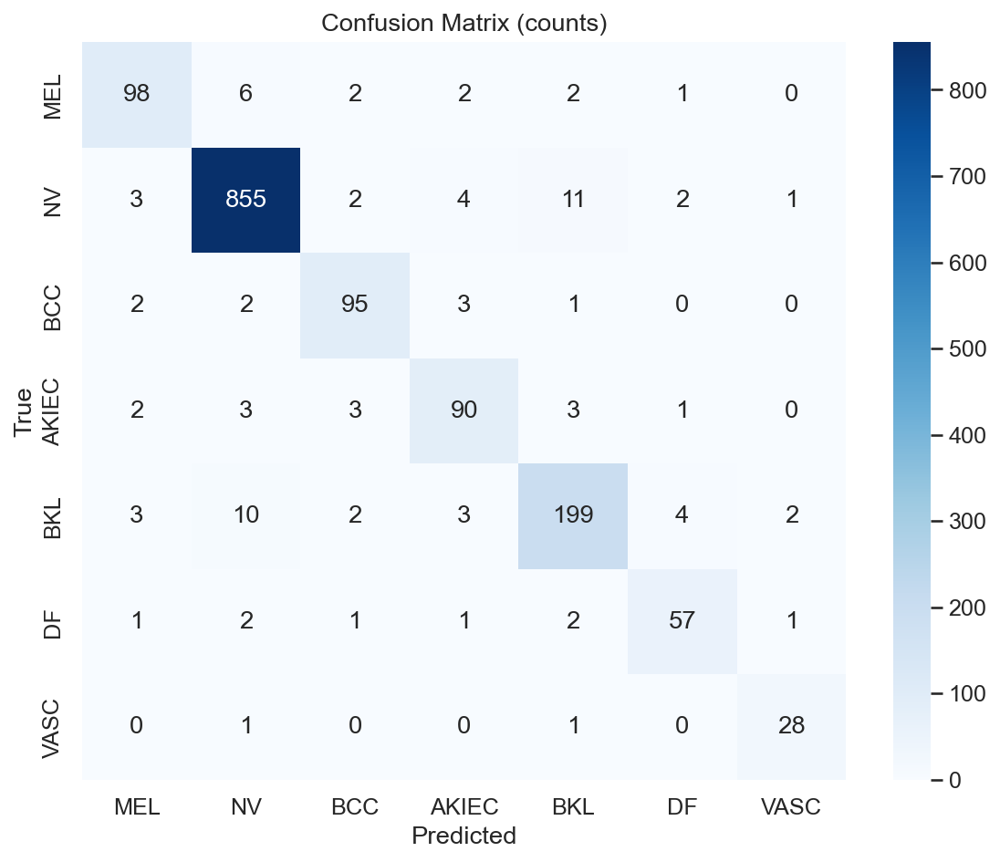

# Phase 3 — Analysis

Turns the raw artifacts written by [`../Training and Validation`](../Training%20and%20Validation/README.md) (`metrics.csv`, `best_metrics.json`, `final_metrics.json`, `best_confusion_matrix.npy`) into tables and plots. **No model inference happens here** — everything below is derived purely from logged numbers.

## Layout

```
Analysis/
├── analyze.py                  # entry point
├── configs/analysis_config.yaml # paths to the Phase 2 log files + output dir
├── src/
│   ├── loader.py                 # reads metrics.csv / *.json / *.npy into one object
│   ├── tables.py                  # per-class & macro CSV/Markdown tables, ranking summary
│   └── visualizer.py                # all matplotlib/seaborn plots
└── outputs/                        # everything below was generated by analyze.py
```

## Code

- **`src/loader.py`** — `load_artifacts` reads `metrics.csv` into a `DataFrame`, both metrics JSONs, and the confusion-matrix `.npy`, returning them bundled in one `SimpleNamespace`. Fails loudly (`FileNotFoundError`) if training hasn't been run yet.
- **`src/tables.py`** — `build_per_class_table` (per-class CSV + Markdown), `macro_summary_table` (one-row macro CSV), `best_and_worst_classes` (ranks classes by a chosen metric, default F1, writes `summary.txt`), `epoch_history_table` (copies the full per-epoch history).
- **`src/visualizer.py`** — `plot_training_curves` (loss, then macro F1/accuracy/AUC-ROC/recall over epochs), `plot_per_class_metrics_bar` (2×4 grid, one panel per metric), `plot_confusion_matrix` (raw counts + row-normalised), `plot_per_class_metric_comparison` (4×2 grid highlighting the best class in green and worst in red per metric).
- **`analyze.py`** — loads config, loads artifacts, and calls every table/plot function above in sequence.

## Running it

```bash
cd Analysis
python analyze.py --config configs/analysis_config.yaml --metric f1
```

## Results

Model: DenseNet-121, trained from scratch in NumPy on ISIC 2018 Task 3 (7 classes). Best epoch by validation macro F1: **epoch 34**.

### Macro-averaged metrics (best epoch)

| Accuracy | Precision | Recall | Specificity | F1 | Dice | Jaccard | AUC-ROC |
|---:|---:|---:|---:|---:|---:|---:|---:|
| 0.9405 | 0.9016 | 0.9091 | 0.9877 | 0.9052 | 0.9052 | 0.8283 | 0.9729 |

### Training dynamics

The phase transition at epoch 8 (frozen backbone → full fine-tune) shows up as a brief spike before the model settles into its fine-tuning descent.


### Per-class performance

NV — the dominant class even after weighted sampling — reaches the highest F1. DF, the rarest class in the raw data, comes in lowest, though still well above 0.87.

| Class | Accuracy | Precision | Recall | Specificity | F1 | Dice | Jaccard | AUC-ROC |
|---|---:|---:|---:|---:|---:|---:|---:|---:|
| MEL | 0.9841 | 0.8991 | 0.8829 | 0.9921 | 0.8909 | 0.8909 | 0.8033 | 0.9681 |
| NV | 0.9689 | 0.9727 | 0.9738 | 0.9621 | 0.9732 | 0.9732 | 0.9479 | 0.9820 |
| BCC | 0.9881 | 0.9048 | 0.9223 | 0.9929 | 0.9135 | 0.9135 | 0.8407 | 0.9754 |
| AKIEC | 0.9835 | 0.8738 | 0.8824 | 0.9908 | 0.8780 | 0.8780 | 0.7826 | 0.9612 |
| BKL | 0.9709 | 0.9087 | 0.8924 | 0.9845 | 0.9005 | 0.9005 | 0.8189 | 0.9643 |
| DF | 0.9894 | 0.8769 | 0.8769 | 0.9945 | 0.8769 | 0.8769 | 0.7808 | 0.9701 |
| VASC | 0.9960 | 0.8750 | 0.9333 | 0.9973 | 0.9032 | 0.9032 | 0.8235 | 0.9889 |




### Confusion matrix

The diagonal is uniformly strong; what confusion exists is concentrated between visually similar classes (MEL/NV, BKL/AKIEC).




### Class ranking by F1

| Rank | Class | F1 | |
|---:|---|---:|---|
| 1 | NV | 0.9732 | best |
| 2 | BCC | 0.9135 | |
| 3 | VASC | 0.9032 | |
| 4 | BKL | 0.9005 | |
| 5 | MEL | 0.8909 | |
| 6 | AKIEC | 0.8780 | |
| 7 | DF | 0.8769 | worst |

### Takeaways

- **Weighted random sampling + focal loss** together handle a dataset where NV is ~68% of samples and DF/VASC are under 3% combined, without needing to discard any data.
- **Two-phase training** (frozen-backbone warm-up, then full fine-tune) avoids letting a randomly-initialised head destroy the backbone's features in the first few epochs.
- **Cosine annealing + patience-12 early stopping** lets the optimizer keep exploring past small plateaus without over-fitting a <10k-image dataset.
- **Heavy dropout (0.6)** regularises a ~7M-parameter network trained on well under 10,000 images.

All raw tables backing this section (`per_class_metrics.csv`/`.md`, `macro_summary.csv`, `summary.txt`, `epoch_history.csv`) are in [`outputs/`](outputs/).
