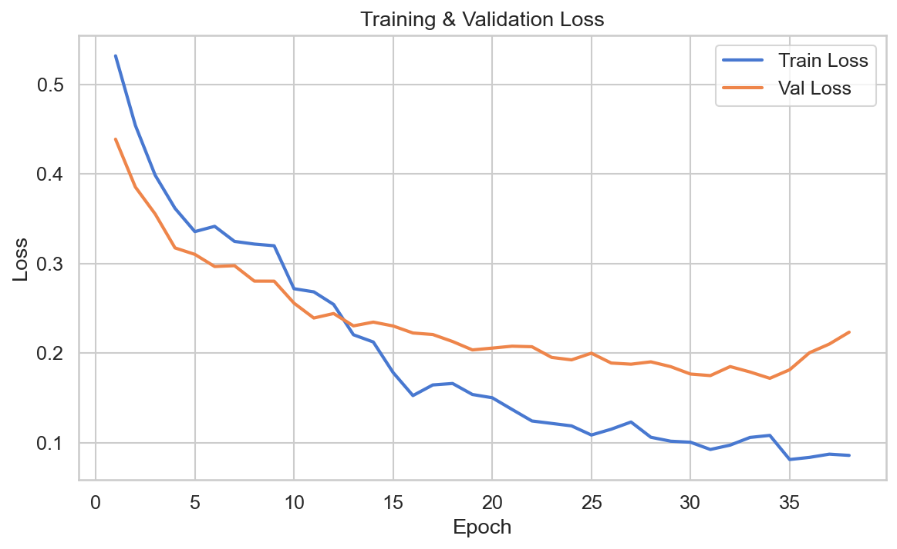
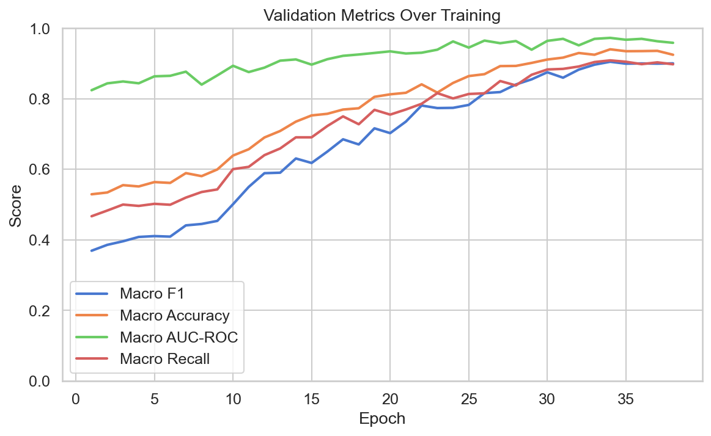
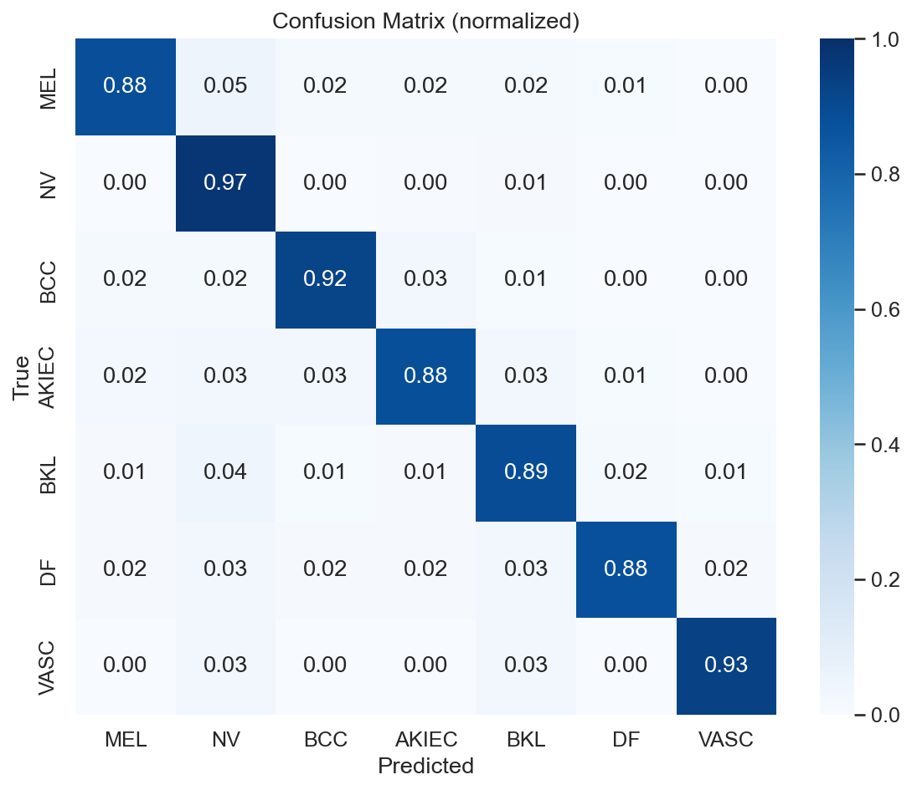
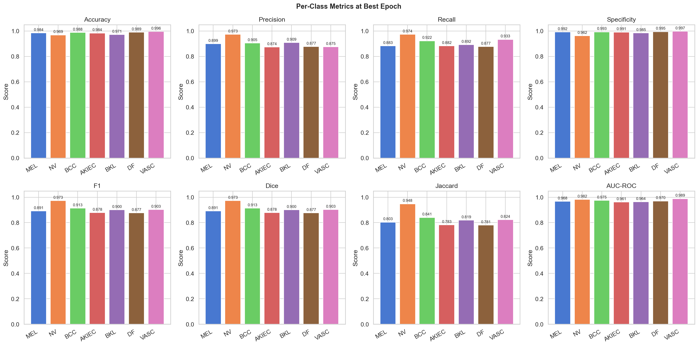

# Skin Lesion Segmentation & Classification — ISIC 2018 (DenseNet-121 from Scratch)

An end-to-end computer-aided diagnosis pipeline for the **ISIC 2018 Task 3** dermoscopy benchmark: hair removal and enhancement, Fuzzy C-Means lesion segmentation, and a **DenseNet-121 classifier implemented entirely from scratch in NumPy** (no PyTorch/TensorFlow/Keras/JAX) across seven diagnostic classes.

By **Baraa Lazkani** and **Modar Ibrahim**.

## Motivation

Skin cancer is among the most common cancers worldwide, and dermoscopy — imaging skin lesions through a dermatoscope — gives a non-invasive window into their structure. Even trained dermatologists find dermoscopy classification challenging: the visual differences between benign and malignant lesions can be subtle. Computer-aided diagnosis (CAD) systems built on deep learning have shown strong potential here, and this project builds a complete pipeline for the ISIC 2018 Task 3 benchmark: image enhancement, lesion segmentation, and multi-class classification.

## Original contribution

> The **Preprocessing & Segmentation** phase ([`Dara Preprocessing & Segmentation/`](Dara%20Preprocessing%20%26%20Segmentation/README.md)) was provided as part of the project framework and is not original work.
>
> The **Training & Validation** phase ([`Training and Validation/`](Training%20and%20Validation/README.md)) was designed and implemented **entirely from scratch**, using **pure NumPy only** — no deep learning framework was used for the model, optimizer, loss, or data pipeline. That includes:
> - A full DenseNet-121 forward and backward pass
> - Custom convolution via `im2col`/`col2im`
> - Batch Normalization, Dropout, and Pooling layers, each with a hand-derived backward pass
> - An Adam optimizer with bias correction
> - Focal Loss with an analytic gradient
> - Cosine annealing and early stopping
> - Weighted random sampling for class imbalance
>
> The **Analysis** phase ([`Analysis/`](Analysis/README.md)) post-processes the saved training logs into tables and plots — no re-inference.

## Pipeline

```
Raw image
   │
   ▼
┌─────────────────────────── Phase 1 — Preprocessing & Segmentation ───────────────────────────┐
│ Homomorphic filtering → CLAHE → Black Hat (hair detect) → Gaussian → Adaptive threshold →     │
│ Inpainting (hair removal) → Resize 256×256 → Fuzzy C-Means segmentation → Post-processing      │
└─────────────────────────────────────────────────────────────────────────────────────────────┘
   │
   ▼
┌─────────────────────────── Phase 2 — Training & Validation (from scratch) ───────────────────┐
│ Augmentation (flip/rotate/jitter) → DenseNet-121 (NumPy) → Focal Loss + backprop → Adam        │
│ (two-phase: frozen-backbone warm-up, then full fine-tune under cosine annealing)                │
└─────────────────────────────────────────────────────────────────────────────────────────────┘
   │
   ▼
┌─────────────────────────── Phase 3 — Analysis ───────────────────────────────────────────────┐
│ Load logs → tables & metrics → plots & confusion matrix → report                               │
└─────────────────────────────────────────────────────────────────────────────────────────────┘
```

## Dataset: ISIC 2018 Task 3

Seven diagnostic classes, heavily imbalanced (NV ≈68% of the training split; DF and VASC together <3%):

| Code | Full name | Train count | Description |
|---|---|---:|---|
| MEL | Melanoma | 1,113 | Malignant melanocytic tumour |
| NV | Melanocytic Nevi | 6,705 | Common benign mole |
| BCC | Basal Cell Carcinoma | 514 | Most common skin cancer |
| AKIEC | Actinic Keratosis / Bowen's Disease | 327 | Pre-malignant sun-damage lesion |
| BKL | Benign Keratosis-like Lesion | 1,099 | Seborrheic keratosis |
| DF | Dermatofibroma | 115 | Benign fibrous skin nodule |
| VASC | Vascular Lesions | 142 | Angioma, angiokeratoma, etc. |
| **Total** | | **9,835** | |

Addressing this imbalance — via weighted random sampling and focal loss, without discarding data — is the central design concern of Phase 2.

## Repository layout

```
Deep Learning Project/
├── Dara Preprocessing & Segmentation/   # Phase 1 (provided) — see its README
│   ├── src/01_preprocessing_and_segmentation.ipynb
│   └── results/ (ground-truth CSVs + segmented images)
├── Training and Validation/             # Phase 2 (original work) — see its README
│   ├── train.py, configs/config.yaml
│   ├── src/ (dataset.py, model.py, losses.py, metrics.py, trainer.py, utils.py)
│   └── logs/ (metrics.csv, best/final metrics + confusion matrices, train.log)
├── Analysis/                            # Phase 3 — see its README
│   ├── analyze.py, configs/analysis_config.yaml
│   ├── src/ (loader.py, tables.py, visualizer.py)
│   └── outputs/ (tables + plots)
├── documentation.tex / documentation.pdf  # full written report
└── README.md                              # this file
```

Each phase has its own README with a detailed code walkthrough:

- [`Dara Preprocessing & Segmentation/README.md`](Dara%20Preprocessing%20%26%20Segmentation/README.md) — the 10-step image-processing pipeline
- [`Training and Validation/README.md`](Training%20and%20Validation/README.md) — the from-scratch DenseNet-121, training loop, and every hyperparameter
- [`Analysis/README.md`](Analysis/README.md) — how the tables and plots below were produced

## Results

Best epoch (by validation macro F1): **34**.

| Accuracy | Precision | Recall | Specificity | F1 | Dice | Jaccard | AUC-ROC |
|---:|---:|---:|---:|---:|---:|---:|---:|
| 0.9405 | 0.9016 | 0.9091 | 0.9877 | **0.9052** | 0.9052 | 0.8283 | **0.9729** |









NV (the dominant class) reaches the highest per-class F1 (0.9732); DF (the rarest class) is lowest, at 0.8769 — still a strong result for a class with only 115 training images. Full per-class tables, the raw confusion-matrix counts, and the per-metric best/worst comparison are in [`Analysis/README.md`](Analysis/README.md).

## Key design decisions

- **Weighted random sampling + Focal Loss (γ=2)** together correct for the ~58:1 imbalance between NV and DF without discarding any data.
- **Two-phase training** — 8 epochs with the backbone frozen (classifier head only, LR 1e-3), then full fine-tuning (LR 3e-5, cosine annealed) — avoids a randomly-initialised head destroying pretrained-scale feature representations early on.
- **Heavy dropout (0.6)** regularises a ~7M-parameter DenseNet-121 trained on fewer than 10,000 images.
- **Early stopping** (patience 12, monitoring macro F1) resets its counter at the phase-1→phase-2 boundary so the LR-schedule reset doesn't trigger a false stop.

## Running the pipeline

```bash
# Phase 1: run the notebook in Dara Preprocessing & Segmentation/src/ to produce results/

# Phase 2: train the classifier
cd "Training and Validation"
python train.py --config configs/config.yaml

# Phase 3: analyze the resulting logs
cd ../Analysis
python analyze.py --config configs/analysis_config.yaml --metric f1
```

## Full report

See [`documentation.pdf`](documentation.pdf) / [`documentation.tex`](documentation.tex) for the complete written report, including the architecture diagrams and full discussion.
